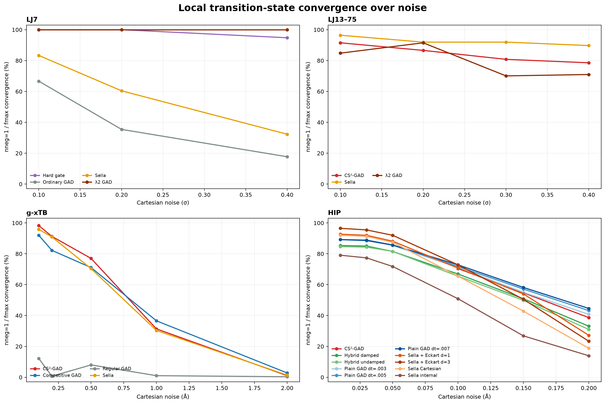
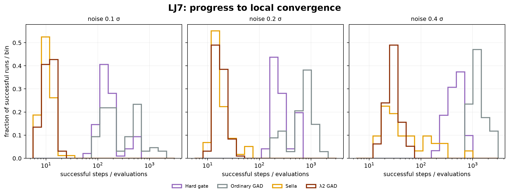
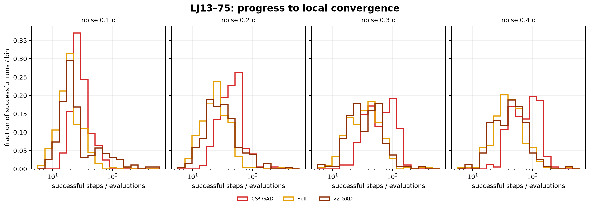
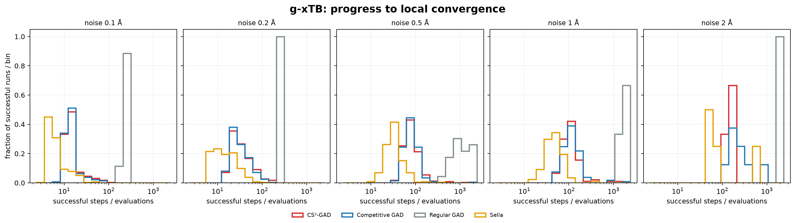
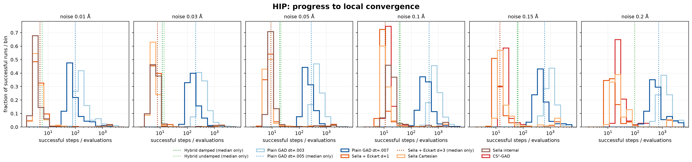

# Every method on every surface

**Bold is best within each benchmark.**

| Benchmark | Method | nneg=1 / fmax | IRC | Median successful steps/evaluations |
|---|---|---:|---:|---:|
| **LJ7** (288 starts) | Ordinary GAD | 39.9% | 39.9% | 494 |
| | Sella | 58.7% | 58.0% | **13** |
| | Hard descent gate | 98.3% | 98.3% | 240 |
| | λ2 GAD | **100%** | **100%** | 17 |
| **LJ13–75, 0.10/0.20 noise** (448 starts) | λ2 GAD | 88.2% | 44.6% | 25 |
| | CS²-GAD | 89.1% | 46.2% | 32 |
| | λ2 or CS² (two searches) | **98.7%** | **64.1%** | — |
| | Sella | 94.2% | 45.1% | **20.5** |
| **LJ13–75, 0.30/0.40 noise** (448 starts) | λ2 GAD | 70.5% | 37.3% | 40 |
| | CS²-GAD | 79.7% | 36.4% | 73 |
| | λ2 or CS² (two searches) | 90.4% | **53.6%** | — |
| | Sella | **90.8%** | 39.3% | **37** |
| **g-xTB, 0.20 A** (287 starts) | Regular GAD | 0.7% | 0.7% | 282.5 |
| | Competitive GAD | 82.2% | 42.9% | 28 |
| | CS²-GAD | **91.3%** | **43.2%** | 29.5 |
| | Sella | 90.9% | 37.3% | **15** |
| **HIP, 0.20 A** (287 held-out starts) | Plain GAD, `dt=.003` | 40.8% | **44.6%** | 1,196 |
| | Plain GAD, `dt=.005` | 43.2% | **44.6%** | 738 |
| | Plain GAD, `dt=.007` | **44.6%** | 43.9% | 546 |
| | CS²-GAD | 38.7% | 40.8% | 5,001 evals |
| | Sella, Cartesian | 18.8% | 17.8% | 20 |
| | Sella + Eckart, Hessian every step | 27.2% | 23.3% | **13** |
| | Sella + Eckart, Hessian every 3 steps | 23.3% | 22.0% | — |
| | Sella, internal coordinates | 13.9% | 16.0% | — |
| | GAD + damped Newton refinement | 33.1% | 38.7% | 95 |
| | GAD + undamped Newton refinement | 31.0% | 38.7% | 95 |

## Visual companion

The histograms use a log progress axis and are normalized within each method's
successful runs, so their shapes compare speed without hiding the convergence
rates above. Dotted lines in the HIP figure are medians where the historical
campaign retained aggregate progress but not its run-level distribution.

Reproducible inputs: [rates](data/all_methods_all_surfaces/convergence_rates.csv),
[successful-run progress](data/all_methods_all_surfaces/successful_progress.csv),
and [aggregate-only medians](data/all_methods_all_surfaces/median_only_progress.csv).
The extraction and plotting code is
[`scripts/plot_main_table_companion.py`](../../scripts/plot_main_table_companion.py).
